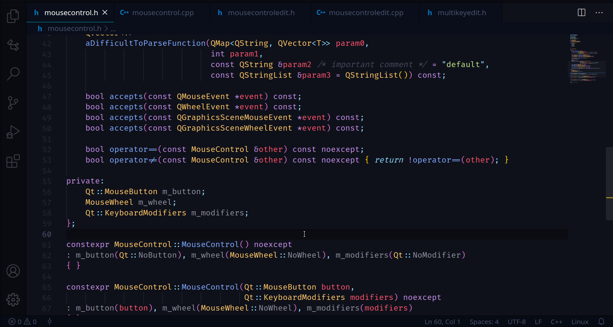

<h1 align="center">
    
     
    <b>C-mantic</b>
</h1>

C/C++ extension for VS Code that provides various IDE-like commands and refactorings. Relevant code-actions are suggested via the light-bulb menu, and can be accessed directly by selecting `Refactor...` or `Source Actions...` in the editor context menu. All code-actions are also available from the command palette or by keyboard shortcut.

## **Features at a glance**

- [Add Definition](#add-definition)
- [Move Definition](#move-definition)
- [Generate Getter and Setter Member Functions](#generate-getter-and-setter-member-functions)
- [Create Matching Source File](#create-matching-source-file)
- [Add Header Guard](#add-header-guard)
- [Add Include](#add-include)
- [Switch Header/Source in Workspace](#switch-headersource-in-workspace)

## **Requirements**

C-mantic requires a C/C++ language server extension for full functionality, such as Microsoft's `C/C++` extension (ms-vscode.cpptools). See [Language Server](#language-server) For more details.

## **Issues and Feature Requests**

If you find a bug or would like to suggest a new feature/functionality, please open an [Issue](https://github.com/BigBahss/vscode-cmantic/issues) on Github. Also, consider leaving the extension a [rating](https://marketplace.visualstudio.com/items?itemName=tdennis4496.cmantic#review-details).

## **Features in-depth**

### **Add Definition**

Selecting an undefined function declaration will suggest the following code-actions in the light-bulb menu.

The `cmantic.addDefinitionInSourceFile` command/code-action creates an empty definition in a matching source file from a function declaration in a header file.

The `cmantic.addDefinitionInCurrentFile` command/code-action creates an empty definition in the current file from a function declaration.

`Add Definition` will look for definitions of neighboring declarations in the target file and try to place new definitions next to them. If a neighboring definition cannot be found then the new definition will be placed at the end of the file. Additionally, `Add Definition` will respect the formatting of your code and will intelligently adapt the whitespace allignment in the case of multi-line declarations. The placement of the opening curly brace can be controlled with `Curly Brace Format: Function` in the settings for C and C++. By default, the new definition will be revealed in the editor when added. This can be disabled with `Reveal New Definition` in the settings.

### **Move Definition**

Selecting the name of a function definition will suggest the following code-actions in the light-bulb menu.

The `cmantic.moveDefinitionToMatchingSourceFile` command/code-action will move a function definition to a matching header/source file.

The `cmantic.moveDefinitionIntoOrOutOfClass` command/code-action will move a member function definition into/out-of a class body.

`Move Definition` tries to find a good location for the function in the same way that `Add Definition` does. Also, when moving a definition from a header file that does not contain a declaration for that function, or when moving from a class body, a declaration will be left behind in its place. Moving definitions will also move leading comments. If you don't want leading comments to be moved when a declaration is being left behind, disable `Always Move Comments` in the settings.

### **Generate Getter and Setter Member Functions**

Selecting a class member variable will suggest the following code-actions based on what accessor function(s) already exist for that member variable.

The `cmantic.generateGetterSetter`, `cmantic.generateGetter`, and `cmantic.generateSetter` commands/code-actions will generate accessor functions for a member variable within a class. C-mantic will look for common private member naming schemes in order to generate appropriate accessor names. If a member variable name begins and/or ends with underscore(s), or if it begins with `m_` or `s_`, these characters will be removed to create the member function names. For example, a member `int m_data` will generate accessors `int data() const` and `void setData(int value)`, whereas a member `int data` will generate accessors `int getData() const` and `void setData(int value)`.

Additionally, for non-primitive, non-pointer data types, setters will be generated with a const-reference (`const &`) parameter type. If you would like C-mantic to resolve `typedef`'s, `type-alias`'s, and `enum`'s, enable `Cpp: Resolve Types` in the settings (This is disabled by default as it may impact the performance of generating setters).

`Accessor: Getter Definition Location` and `Accessor: Setter Definition Location` in the settings control where the definitions of these member functions are placed (Inline, below class body, or in matching source file).

### **Create Matching Source File**
`Create Matching Source File` can be found under `Source Actions...` in the editor context menu.

The `cmantic.createMatchingSourceFile` command/code-action creates a new source file from a header by prompting you for a target directory and file extension. Target directories containing source files will be recommended based on their similarity the header file's directory. Additionally, C-mantic will automatically pick a file extension if all source files in the target directory have the same extension. An include statement for the header file will be inserted into the new source file.

When creating a C++ source file from a header containing namespaces, these namespace blocks will be generated too. Check out the settings for various ways to customize this behavior, or to turn off namespace generation entirely.

### **Add Header Guard**
`Add Header Guard` can be found under `Source Actions...` in the editor context menu.

The `cmantic.addHeaderGuard` command/code-action adds a header guard to the current header file based on `Header Guard: Style` in the settings. Based on this setting C-mantic will insert either a conditional `#define` block, `#pragma once`, or both. `#define` names are generated based on `Header Guard: Define Format` in the settings.

### **Add Include**
`Add Include` can be found under `Source Actions...` in the editor context menu.

The `cmantic.addInclude` command/code-action adds includes to the top of the file from your current position. The command parses existing include statements to find the best position to add the new include. For example, if you're adding a system include (`#include <...>`), it will append it to the largest block of sequential system include statements in the file. Same for project includes (`#include "..."`).

### **Switch Header/Source in Workspace**
The `cmantic.switchHeaderSourceInWorkspace` command will open and switch to the matching header/source file cooresponding to the active file. C-mantic will only look for matching header/source files within the current workspace, which may offer better accuracy over other implementations. You can control whether or not this appears in the editor context menu with `Context Menu: Switch Header Source` in the settings.

## **Language Server**

The features that require a C/C++ language server extension are: `Add Definition`, `Move Definition`, `Generate Getter and Setter Member Functions`, and namespace generation for `Create Matching Source File`. If you find that these features aren't working, make sure your language server is working correctly. To do this, check out the Outline view, usually found in Explorer in the side-bar. The Outline view should show all symbols for the current file. Also, make sure 'Go to Definition' and 'Go to Declaration' are working.

C-mantic is primarily tested with `C/C++` (ms-vscode.cpptools), but also works with `clangd` (llvm-vs-code-extensions.vscode-clangd) and `ccls` (ccls-project.ccls). If you use a different language server, C-mantic may still work, but extensively testing each one is difficult. If you find bug while using a language server other than `C/C++` (ms-vscode.cpptools), please open an [Issue](https://github.com/BigBahss/vscode-cmantic/issues) and include what language server you are using.

## **Planned Features**

The list of planned features/ideas can be found [here](https://github.com/BigBahss/vscode-cmantic/blob/master/TODO.md). I'd love to here ideas for new features/functionalities via opening an [Issue](https://github.com/BigBahss/vscode-cmantic/issues) on Github. And of course, if you'd like to contribute, feel free to open a pull-request.

## **License**

This software is released under the [MIT License](https://opensource.org/licenses/MIT)
