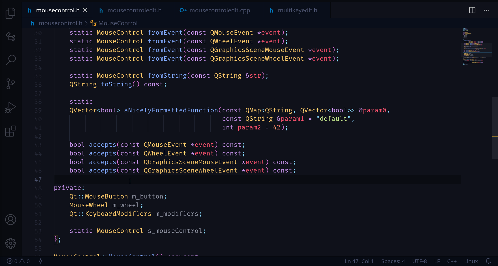

## **Add Definition**

Selecting an undefined function declaration will suggest the following code-actions 💡.

The `Add Definition in matching source file` command generates an empty definition in a matching source file for a function declared in a header file.

The `Add Definition in this file` command generates an empty definition for a function declaration in the current file.

`Add Definition` will look for definitions of neighboring declarations in the target file and try to place new definitions in the same relative order. If a neighboring definition cannot be found then the new definition will be placed at the end of the file. Additionally, `Add Definition` will respect the formatting of your code and will intelligently adapt the whitespace alignment in the case of multi-lined declarations. The placement of the opening curly brace can be controlled with the setting `Curly Brace Format: Function` for C and C++, each. By default, the new definition will be revealed in the editor when added. This can be disabled with `Reveal New Definition` in the settings.

You may also generate many definitions at a time by selecting `Add Definitions...` in the `Refactor...` menu. This command will find all undefined functions in the file and prompt you to select which ones to add definitions for. After selecting functions you will be prompted to select which file to add the definitions to (either the same file, or the matching source file). If a matching source file doesn't already exist, you can select to create one (this invokes [Create Matching Source File]({{ site.url }}/vscode-cmantic/features/create-matching-source-file/)).

## **Generate Constructor**

`Generate Constructor` extends `Add Definition` by prompting you to select what you want to initialize in the constructor (delegating constructor, base class constructor(s), member variables) and will generate the boiler-plate for the initializer list.
