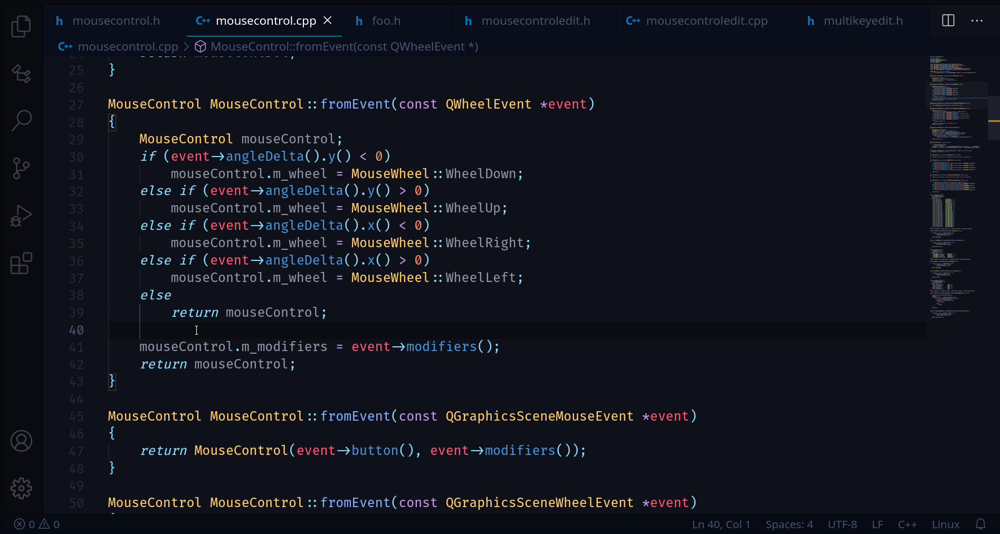

# Add Include

`Add Include` can be found in the `Source Actions...` menu.

The `Add Include` command adds a new include statement to the top of the file from your current position. C-mantic will parse existing include statements to find the best position to add the new include. For example, if you're adding a system include (`#include <...>`), it will be inserted after the last system include statement that appears above your current position. Same for project includes (`#include "..."`). Also, `Add Include` will begin providing completion suggestions as soon as you type `<` or `"`.

