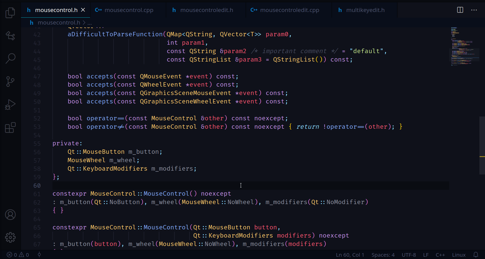

### **Generate Getters and Setters**

Selecting the name of a member variable will suggest the following code-actions 💡.

The `Generate Getter and Setter`, `Generate Getter`, and `Generate Setter` commands will generate accessor functions for a member variable. C-mantic will look for common private member naming schemes in order to generate appropriate function names: If a member variable name begins and/or ends with underscore(s), or if it begins with `m_` or `s_`, these characters will be removed to create the member function names. The `Case Style` setting controls whether names are generated in snake_case, camelCase, or PascalCase.

Additionally, for non-primitive, non-pointer data types, setters will be generated with a const-reference (`const &`) parameter type. If you would like C-mantic to resolve `typedef`'s, `type-alias`'s, and `enum`'s, enable `Cpp: Resolve Types` in the settings (This is disabled by default as it may impact the performance of generating setters).

The `Accessor: Getter Definition Location` and `Accessor: Setter Definition Location` settings control where the definitions of these member functions are placed (either inline, below class body, or in matching source file).
