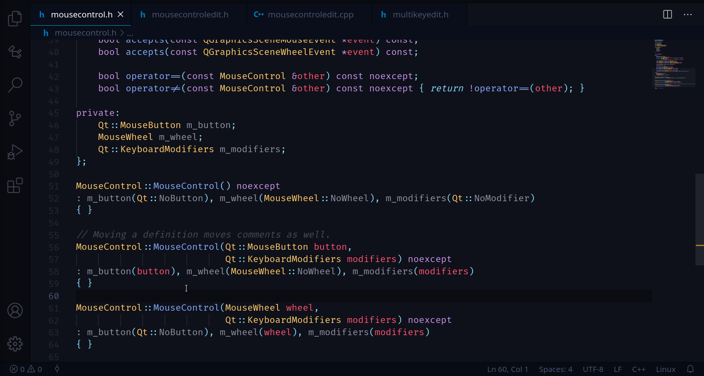

## **Move Definition**

Selecting the name of a function definition will suggest the following code-actions 💡.

The `Move Definition to matching source file` command will move a function definition to a matching header/source file.

The `Move Definition into/out-of class body` command will move a member function definition into/below a class body.

`Move Definition` tries to find a good location for the function in the same way that `Add Definition` does. Also, when moving a definition from a header file that does not contain a declaration for that function, or when moving from a class body, a declaration will be left behind in its place. Moving definitions will also move leading comments. If you don't want leading comments to be moved when a declaration is being left behind, disable `Always Move Comments` in the settings.
