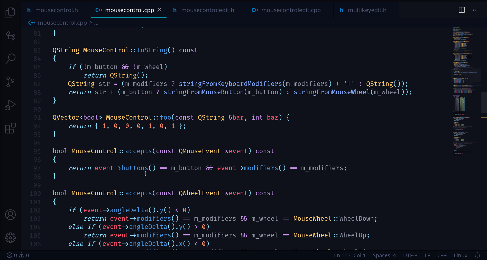

# Update Function Signature (coming in v0.9.0)

`Update Function Signature` makes it easier to refactor a function's interface by eliminating the need to edit the declaration and definition individually. Easily edit a function's parameters, return type, and specifiers/qualifiers, and C-mantic can apply those changes to the function's declaration/definition.

After changing a function's signature that had a matching declaration/definition, the code-action `Update Function Declaration`/`Update Function Definition` will be suggested (via the light-bulb 💡 or `Refactor...` menus). This feature automatically detects changes to function signatures as you type, which makes editing feel natural. There is no need to indicate beforehand that you want to change a function's signature, nor do you need to use a clunky interface to do so. Just edit code as you normally would and then apply the refactoring to update the declaration/definition.
